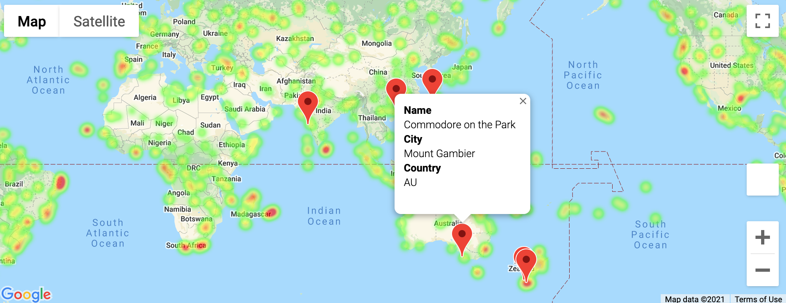

# Weather API

## Tools
Python, Requests, OpenWeatherAPI, Jupyter Gmaps, CitiPy, Matplotlib. 

## Background

This script analyzes how weather changes as we approach the equator.

### WeatherPy

Python script that visualizes the weather of 500+ cities across the world of varying distance from the equator. 

Randomly generated coordinates are passed through the [CitiPy](https://pypi.org/project/citipy/) module to obtain city names. The cities are passed through the [OpenWeatherAPI](https://openweathermap.org/current) to get weather data. 

A series of scatter plots showcases the following relationships:

Temperature (F) vs. Latitude
Humidity (%) vs. Latitude
Cloudiness (%) vs. Latitude
Wind Speed (mph) vs. Latitude

The data is separated into hemispheres to showcase the following relationships:

Northern Hemisphere - Temperature (F) vs. Latitude
Southern Hemisphere - Temperature (F) vs. Latitude
Northern Hemisphere - Humidity (%) vs. Latitude
Southern Hemisphere - Humidity (%) vs. Latitude
Northern Hemisphere - Cloudiness (%) vs. Latitude
Southern Hemisphere - Cloudiness (%) vs. Latitude
Northern Hemisphere - Wind Speed (mph) vs. Latitude
Southern Hemisphere - Wind Speed (mph) vs. Latitude

### VacationPy

Gmaps is used to generate a heat map based on humidity for the cities obtained from WeatherPy. To narrow down the data, we select cities fitting the specific criteria before running the cities through the Google Places API to obtain hotel information, which is added to the heat map. 

